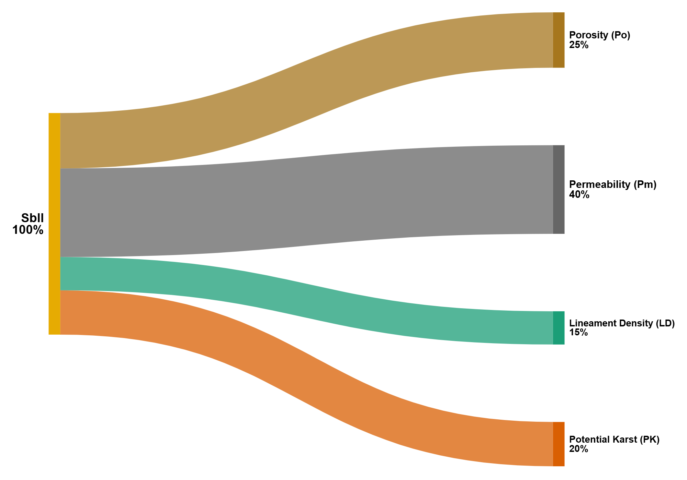

# Arizona Subsurface Infiltration Index v.2

- This layer and its associated data will be available on hydroshare soon
- The Sbii_v2_.tif will be published on ArcGIS online and available to the public soon

**v.1 was not released and was only used for internal testing
## Authors

- Ryan E Lima (Northern Arizona University, 0000-0002-5352-7215) Ryan.lima@nau.edu
- Temuulen T. Sankey (Northern Arizona University, 0000-0002-7859-8394 )
- Abraham E. Springer (Northern Arizona University, 0000-0003-4826-9124)

## Description
This dataset represents the Arizona Subsurface Infiltration Index v.2 (SbII), a raster-based index developed to estimate the relative potential for water to infiltrate into subsurface lithologic units across the state of Arizona. The goal of this layer is to support landscape-scale planning for groundwater recharge enhancement by identifying regions with favorable subsurface conditions for infiltration.

The index is derived from a weighted linear combination of four geologic and structural variables that influence the movement of water through the vadose zone and into underlying aquifers:

**Matrix Permeability (Pm)** – log-transformed saturated hydraulic conductivity (log K) from the GLobal HYdrogeology MaPS (GLHYMPS v2) dataset (Huscroft et al., 2018), which reflects the ability of the geologic matrix to transmit water.

**Matrix Porosity (Po)** – volumetric porosity values from GLHYMPS v2, which influence the capacity for water storage within rock or sediment pore spaces.

**Lineament Density (LD)** – estimated from topographic and statistical surface derivatives using automated lineament extraction. These features are used as proxies for secondary permeability from faults and fractures, which can enhance infiltration along structurally controlled zones.

**Presence of Karst or Pseudokarst Lithologies (Pk)** – derived from national-scale karst mapping (Weary and Doctor, 2014), this factor accounts for lithologies prone to dissolution (e.g., carbonates, evaporites) or lava tube development, which can produce highly permeable pathways for focused recharge.

Each input layer was reclassified to a common suitability scale from 1 to 10, where 10 indicates the highest potential for infiltration and 1 the lowest. This reclassification was based on literature-supported thresholds, expert knowledge, and the distribution of values within the Arizona study area (see Methodology section for details).

This layer is intended to provide a spatially explicit, state-wide estimate of infiltration suitability, particularly useful for identifying regions where managed aquifer recharge (MAR) or landscape management strategies (e.g., thinning, floodwater retention) may have the greatest potential impact on subsurface recharge. However, due to the scale and resolution of the input data, this index is not appropriate for parcel-scale or engineering design applications. Local field investigations are essential for evaluating infiltration capacity at specific sites.

## Geographic Coverage
- Latitude: [30.5162255350522, 37.8474133318948]
- Longitude: [-115.428691746036, -107.349953619422]
- CRS: EPSG:4269, NAD83 Geographic Coordinate System (degrees)
---
- Easting (m): [74,884.55, 850,317.80]
- Northing (m): [3,381,660.51, 4,198,137.36]
- CRS: EPSG:26912, NAD83 UTM Zone 12N (meters)

## Temporal Coverage
- N.A. Created in 2025 using data released from 2014 - 2024

## File Descriptions
| File Name                        | Description                                                                    | Format | dtype    | Size         |
|----------------------------------|--------------------------------------------------------------------------------|--------|----------|--------------|
| Lineaments_30m_SD_TPI_gt1000m    | Lineaments extracted using Catalyst LINE from 30m DEM, cleaned lines <1000m    | .zip   | shapefile| 11,176 kb    |
| Lineament_Density_rad1000m_kmkm2 | Line density of above lineaments using 1000m radius                            | .tif   | Float32  | 2,299,507 kb |
| GLHYMPS_v2Permeability           | Permeability logk x1000 extracted from GLHYMPSv2                               | .tif   | 64bit    | 5,791,738 kb |
| GLHYMPS_v2_Porosity              | Porosity (%) from GLHYMPSv2                                                    | .tif   | 64bit    | 5,792,315 kb |
| sLD_5_10                         | Lineament density scaled 5 to 10                                               | .tif   | Uint8    | 575,195 kb   |
| sPk_510                          | Potential karst (rasterized, scaled 5 to 10)                                   | .tif   | Uint8    | 839,966 kb   |
| sPo_110                          | Matrix porosity scaled 1 to 10                                                 | .tif   | Uint8    | 724,639 kb   |
| sPm_110                          | Matrix permeability scaled 1 to 10                                             | .tif   | Uint8    | 724,639 kb   |
| Sbii_v2_                         | Weighted combination of sPk, sPo, sLD, sPm                                     | .tif   | Float32  | 2,299,506 kb |
| Evaporites48_AZHU8p              | Shapefile of evaporites from USA Karst                                         | .zip   | Shapefile| 693 kb       |
| Piping48_AZHU8p                  | Shapefile of piping karst from USA Karst                                       | .zip   | Shapefile| 102 kb       |
| Volcanics48_AZHU8p               | Shapefile of volcanic pseudokarst from USA Karst                               | .zip   | Shapefile| 241 kb       |
| Carbonates48_AZHU8p              | Shapefile of carbonates from USA Karst                                         | .zip   | Shapefile| 1,137 kb     |

## Methodology

### Subsurface Infiltration Index (SbII)

The Subsurface Infiltration Index (SbII) was created by combining layers of Matrix permeability (Pm) and Porosity (Po), Lineament Density (LD), and Potential karst of Pseudo-karst (PK).

#### Matrix Permeability (Pm) and Porosity (Po)

Pm and Po values were extracted from the GLobal Hydrogeology MaPS 2.0 (GLHYMPS v2) dataset (Huscroft et al., 2018). Our study area contained 11,057 polygons with values for saturated log-permeability ranging from -16 to -10 and porosity values ranging from 0.01 - 0.28. The attribute values were extracted, the polygons were rasterized at a 30m resolution and then re-scaled to values (1-10). See the appendix for more details on the rescaling of Po and Pm.

| LogK x 100 (Permeability) | Scaled Permeability (sPm) | Porosity x 100 (%) | Scaled Porosity (sPo) |
|------------------|------------------|------------------|------------------|
| -1650 to -1595            | 1                         | 0 - 2              | 1                     |
| -1595 to -1540            | 2                         | 2 - 5              | 2                     |
| -1540 to -1485            | 3                         | 5 - 8              | 3                     |
| -1485 to -1430            | 4                         | 8 - 10             | 4                     |
| -1430 to -1375            | 5                         | 10 - 13            | 5                     |
| -1375 to -1320            | 6                         | 13 - 17            | 6                     |
| -1320 to -1265            | 7                         | 17 - 21            | 7                     |
| -1265 to -1210            | 8                         | 21 - 24            | 8                     |
| -1210 to -1155            | 9                         | 24 - 26            | 9                     |
| -1155 to -1052            | 10                        | 26 - 28            | 10                    |

: Classification and re-scaling of GLHYMPS v2 data for suitability mapping

#### Lineament Denisty (LD)

Lineaments are linear or curvilinear surface features that may reflect subsurface geologic structures(O’leary et al., 1976). Lineament density(LD) is commonly used in studies evaluating potential recharge zones (Al-Adamat, 2012; Chenini et al., 2010; Chowdhury et al., 2010). Lineaments were extracted from U.S. Geologic Survey, 2019 3D Elevation Program 1-arc-second tiles using a combination of methods. First, topographic position index (TPI) which estimates neighborhood convexity and concavity was calculated using a circular neighborhood with a radius of 5*m* The TPI layer was then rendered as a multi-directional hillshade and exported from ArcGIS to Catalyst 3.0.2, where the LINE module was used to detect edges and link lines (Salui et al., 2018). The default parameters for the LINE function were used, and the resulting lineaments were brought back into ArcGIS and cleaned to remove any edge effects. A second lineament analysis was conducted as with the TPI, using a standard deviation focal statistic of elevation with a 5 *m* radius. This raster was also rendered, exported, and processed as before. These two rasters provided complementary sets of combined lineaments. Due to the resolution and parameters chose, man-made lineaments (roads, railways, and power-lines) were not primarily delineated by the algorithm in either analysis; however buffers around roads were randomly sampled and spot-checked to ensure man-made lineaments were not included.

The output of the LINE tool was exported as a shapefile and analyzed using the Line Density Tool in ArcGIS Pro to calculate the density of lineaments within a circular neighborhood with a radius of 1km, providing lineament density values between 0.001 and 5.55 km/km2. While the presence of lineaments likely enhances the secondary Pm and Po, the absence of lineaments does not necessarily reduce overall recharge suitability. Therefore, we scaled lineament density between 5 and 10 for the thematic layer scaled lineament density (sLD); this is consistent with other GIS-MCDA studies evaluating recharge potential (Shaban et al., 2006).

**Table of parameters values used in LINE algorithm**

| Parameters | Description                  | Units             | Default Values | Distance (m) |
|---------------|---------------|---------------|---------------|---------------|
| RADI       | filter radius                | Pixels (30m)      | 10             | 300          |
| GTHR       | edge gradient threshold      | Luminance (0-255) | 100            | NA           |
| FTHR       | line fitting threshold       | Pixels (30m)      | 3              | 90           |
| LTHR       | curve length threshold       | Pixels (30m)      | 30             | 900          |
| ATHR       | angular difference threshold | degrees           | 30             | NA           |
| DTHR       | linking distance threshold   | Pixels (30m)      | 20             | 600          |

: Default parameters values used to detect lineaments from the TPI and SD rasters with the LINE module of Catalyst 3.0.2. Column one shows the parameter abbreviations commonly used in the literature. Column two describes the parameters. Column three describes the units each parameter utilizes, column four shows the default values, and column five is the linear distance that the default values translate to when using a 30x30 m raster.

**Lineament Density scaled**

|Start Value km/km^2| End Value km/km^2| Scaled Value|
|-------------------|------------------|-------------|
|0.000              |0.001             |      5      |
|0.002              |1.000             |      6      |
|1.001              |2.000             |      7      |
|2.001              |3.000             |      8      |
|3.001              |4.000             |      9      |
|4.001              |5.552 (max)       |     10      |

#### Potential Karst or Pseudo-Karst (PK)

Shapefiles of potential karst or pseudo-karst lithology (PK) were sourced from the Karst in the United States digital map compilation and database (Weary an Doctor, 2014). The polygons were clipped to the AZHU8 study area and converted to a 30*m* raster, and assigned values based on their potential for enhanced recharge through faults, fractures, sinkholes, or caves. The classes were non-karst = 5 (neutral), volcanics with potential karst or pseudo-karst (such as lava tubes) = 7, evaporates at or near the surface = 8, and carbonates at or near the surface = 10, resulting in a scaled potential karst layer (sPK).

#### Creation of SbII

SbII is a weighted linear sum of sPm, sPo, sLD, and sPK, with weights 0.4, 0.25, 0.15, and 0.2, respectively; the equation is shown below. The SbII can be seen as an estimate of the infiltration potential of the subsurface lithology excluding soils (which are included in the SMII index). Due to the resolution of the geologic mapping that produced the GLHYMPS v2 dataset and general lack of detailed geologic mapping in much of Arizona, focused recharge in stream channels is not addressed by this index, and it can be seen as a conservative estimate of recharge potential state-wide.

$$
SbII = sPm * 0.4 + sPo * 0.25 + sLD * 0.15 + sPK * 0.2
$$

## Disclaimer
This dataset was developed to support regional-scale suitability mapping of subsurface infiltration potential in Arizona. While every effort was made to use the best available data and methods, many of the input datasets (e.g., GLHYMPS v2 hydrogeologic polygons, 3DEP-derived lineaments, karst lithology maps) are generalized or coarse in spatial resolution. As such, this index is not suitable for site-specific assessments or design purposes.

Local site characteristics—such as soil thickness, fracture connectivity, and surface recharge dynamics—can vary considerably even within high-index zones. Field-based assessments, subsurface investigations, or finer-scale modeling are essential before making site-level management or engineering decisions.

The weights applied in the Subsurface Infiltration Index (SbII) reflect a single, expert-informed judgment of relative importance based on literature review, data availability, and expert knowledge. Alternative weighting schemes may be equally valid, and users are encouraged to adapt the methodology to suit their own objectives and regional contexts.

This dataset is part of an ongoing research effort to better understand and map the potential for enhanced infiltration and managed aquifer recharge in semi-arid landscapes. We welcome feedback and collaboration to refine and improve this tool for future applications.

## Licensing
CC BY-NC 4.0
https://creativecommons.org/licenses/by-nc/4.0/

## References

- Ahmadi, H., Pekkan, E., & Seyitoğlu, G. (2023). Automatic lineaments detection using radar and optical data with an emphasis on geologic and tectonic implications: A case study of Kabul Block, eastern Afghanistan. Geocarto International, 38(1), 2231400. https://doi.org/10.1080/10106049.2023.2231400

- Chenini, I., Mammou, A. B., & El May, M. (2010). Groundwater Recharge Zone Mapping Using GIS-Based Multi-criteria Analysis: A Case Study in Central Tunisia (Maknassy Basin). Water Resources Management, 24(5), 921–939. https://doi.org/10.1007/s11269-009-9479-1

- Chowdhury, A., Jha, M. K., & Chowdary, V. M. (2010). Delineation of groundwater recharge zones and identification of artificial recharge sites in West Medinipur district, West Bengal, using RS, GIS and MCDM techniques. Environmental Earth Sciences, 59(6), 1209–1222. https://doi.org/10.1007/s12665-009-0110-9

- Huscroft, J., Gleeson, T., Hartmann, J., & Börker, J. (2018). Compiling and Mapping Global Permeability of the Unconsolidated and Consolidated Earth: GLobal HYdrogeology MaPS 2.0 (GLHYMPS 2.0). Geophysical Research Letters, 45(4), 1897–1904. https://doi.org/10.1002/2017GL075860

- O’leary, D. W., Friedman, J. D., & Pohn, H. A. (1976). Lineament, linear, lineation: Some proposed new standards for old terms. Geological Society of America Bulletin, 87(10), 1463--1469. https://doi.org/10.1130/0016-7606(1976)87

- Salui, C. L. (2018). Methodological Validation for Automated Lineament Extraction by LINE Method in PCI Geomatica and MATLAB based Hough Transformation. Journal of the Geological Society of India, 92(3), 321–328. https://doi.org/10.1007/s12594-018-1015-6

- Shaban, A., Khawlie, M., & Abdallah, C. (2006). Use of remote sensing and GIS to determine recharge potential zones: The case of Occidental Lebanon. Hydrogeology Journal, 14(4), 433–443. https://doi.org/10.1007/s10040-005-0437-6

- Weary, D. J., & Doctor, D. H. (2014). Karst in the United States: A Digital Map Compilation and Database (Open-File Report 2014–1156; Open-File Report, p. 27). U.S. Geological Survey, U.S. Department of Interior. https://pubs.usgs.gov/of/2014/1156/

## Citation
Please cite this dataset as:
> Lima, R.E., Sankey, T.T., Springer, A.E. (2025). Arizona Subsurface Infiltration Index v.2 , 2025 [Dataset]. HydroShare. https://doi.org/10.xxxx/xxxxx

## Related Publications
- Lima et al., (In Review). Mapping landscape suitability for thinning to reduce evapotranspiration and enhance groundwater recharge in semi-arid ponderosa pine forests. Journal of Hydrology: Regional Studies.

- Zaleski et al., (In Review). Floodwater Enhanced Recharge Potential in Arizona. Journal of the American Water Resources Association

## Funding
 Arizona Board of Regents for funding this research through the Technology and Research Initiative Fund (TRIF) through the Arizona Tri-University Recharge and Water Reliability Project (ATUR)
